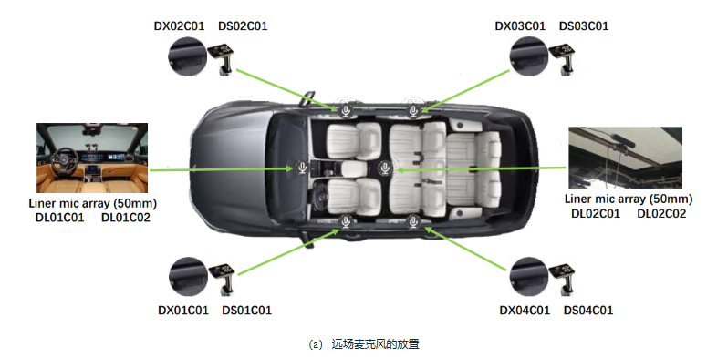
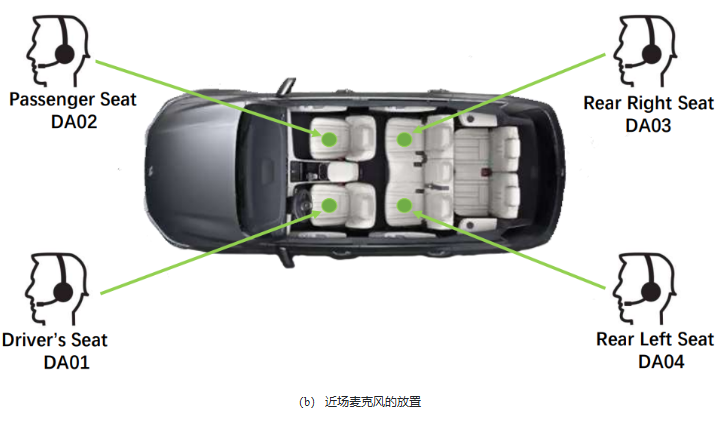

<div align="center">
    <h1>
    AISHELL-5
    </h1>
    <b><em>The First Open-Source In-Car Multi-Channel Multi-Speaker Speech Dataset for Automatic Speech Diarization and Recognition</em></b>
    </p>
    <p>
        
        
        
    </p>
    <p>
    </p>
    <a href="https://arxiv.org/abs/2505.23036"></a>
    <a href="https://github.com/DaiYvhang/AISHELL-5"></a>
    <a href="https://github.com/DaiYvhang/AISHELL-5"></a>
    <a href="https://github.com/DaiYvhang/AISHELL-5"></a>
    <a href="https://github.com/DaiYvhang/AISHELL-5"></a>
</div>

## Introduction

This repository is the baseline code for the AISHELL-5. We add relevant codes of SpatialNet and [silero-vad](https://github.com/snakers4/silero-vad) on the basis of the baseline of [ICMC-ASR](https://github.com/MrSupW/ICMC-ASR_Baseline).

The code in this repository is based on the End-to-End Speech Recognition Toolkit [WeNet](https://github.com/wenet-e2e/wenet) and the Speaker Diarization toolkit [Pyannote-Audio](https://github.com/pyannote/pyannote-audio) and [NBSS](https://github.com/Audio-WestlakeU/NBSS).

## Data Structure Explanation

After downloaded and unzipped the AISHELL-5 dataset, whose folder structure is as follows:

```Shell
AISHELL-5
└── train
|   ├── 001
|   ├── 002
|   ├── 003
|   |   ├── DA0*.wav (near-field headset audios)
|   |   ├── DA0*.TextGrid (label files including speaker label, timestamps and text content)
|   |   ├── DX0[1-4]C01 (4-channel far-field audios)
|   |   └── DX0[5-6]C01 (2-channel reference signals for AEC only existing when the car stereo is turned on)
|   ├── ...
|   └── 568
├── dev
|   ├── 001
|   ├── 002
|   |   ├── DA0*.wav (near-field headset audios)
|   |   ├── DA0*.TextGrid (label files including speaker label, timestamps and text content)
|   |   ├── DX0[1-4]C01 (4-channel far-field audios)
|   |   └── DX0[5-6]C01 (2-channel reference signals for AEC only existing when the car stereo is turned on)
|   ├── ...
|   ├── 018
├── eval_track1 (waiting to release)
|   ├── 001
|   ├── 002
|   |   ├── DA0*.TextGrid (label files including speaker label, timestamps without text content)
|   |   ├── DX0[1-4]C01 (4-channel far-field audios)
|   |   └── DX0[5-6]C01 (2-channel reference signals for AEC only exist when the car stereo is turned on)
|   ├── ...
|   ├── 018
└── eval_track2 (waiting to release)
    ├── 001
    ├── 002
    |   ├── DX0[1-4]C01 (4-channel far-field audios)
    |   └── DX0[5-6]C01 (2-channel reference signals for AEC only exist when the car stereo is turned on)
    ├── ...
    └── 018
```
## Scenario Description
### N: Window open

#### Window state

| Index | Driver’s side window | Sunroof     |
|-------|-----------------------|-------------|
| N1    | Open 1/3              | Closed      |
| N2    | Closed                | Open 1/2    |
| N3    | Open 1/2              | Open 1/2    |

#### Car state

| Index | Drive state | AC     | Car Stereo |
|-------|-------------|--------|------------|
| A     | Stopped     | Off    | Off        |
| B     | Stopped     | Medium | Off        |
| C     | Stopped     | High   | Medium     |
| D     | 0–60 km/h   | Off    | Off        |
| E     | 0–60 km/h   | Medium | Off        |
| F     | 0–60 km/h   | High   | Medium     |

<b>Note: In the case of AISHELL-5 data with number N, various combinations of window state and car state form different composite scenes through random combination.
### M: All windows are closed</b>

#### Car state

| Index | Drive state   | AC     | Car Stereo |
|-------|---------------|--------|------------|
| A     | Stopped       | Off    | Off        |
| B     | Stopped       | Medium | Off        |
| C     | Stopped       | High   | Medium     |
| D     | 0–40 km/h     | Off    | Off        |
| E     | 0–40 km/h     | Medium | Off        |
| F     | 0–40 km/h     | High   | Medium     |
| G     | 40–80 km/h    | Off    | Off        |
| H     | 40–80 km/h    | Medium | Off        |
| I     | 40–80 km/h    | High   | Medium     |
| J     | 80–120 km/h   | Off    | Off        |
| K     | 80–120 km/h   | Medium | Off        |
| L     | 80–120 km/h   | High   | Medium     |

Note: 
1. The correspondence between scenarios and data IDs can be found in the file: ./docs/anonymize_mapping.txt.
2. In addition to the scenario IDs provided in the table below, 1 indicates a daytime scenario, and 0 indicates a nighttime scenario.
3. In the case of AISHELL-5 data with number N, various combinations of window state and car state form different composite scenes through random combination.

## Microphone Positions

The microphone positions in the recording scenes are shown in the figure below, including the close-talking microphone and the far-field microphone:




<b>
Note:
In this AISHELL-5 training set, only the audio recorded by the close-talking microphones (starting with DA) and far-field microphones (starting with DX01-04), as well as some re-recorded audio (starting with DX05-06), are publicly released.
</b>

## Environment Setup

```Shell
# create environment
conda create -n aishell5 python=3.9 -y
conda activate aishell5
# install cudatoolkit and cudnn
conda install cudatoolkit=11.6 cudnn=8.4.1 -y
# install pytorch torchvision and torchaudio
pip install torch==1.13.1+cu116 torchvision==0.14.1+cu116 torchaudio==0.13.1 --extra-index-url https://download.pytorch.org/whl/cu116
# install other dependence
pip install -r requirements.txt
```

## Eval1

The main steps are all in eval1_asr/run.sh

**[Stage 0]** Audio Frontend AEC + IVA. Segment long waves into short slices and prepare the data files (wav.scp, text, utt2spk and spk2utt).

**[Stage 1]** Compute CMVN value of training set for audio feature normalization.

**[Stage 2]** Generate the token list (char).

**[Stage 3]** Prepare the data in the WeNet required format.

**[Stage 4]** Train the ASR model following the train config file.

**[Stage 5]** Do model average and decoding.


## Eval2

Before running the Eval2, please make sure you have run all the stages in eval1_asr/run.sh and get the trained ASR model.

The VAD model of the track2 baseline is based on [Pyannote-Audio](https://github.com/pyannote/pyannote-audio) or [Silero](https://github.com/snakers4/silero-vad). The installation steps are as follows.

1. Create a new conda environment with python3.9+ and torch2.0.0+ by the following steps. Or just modify the torch version of the conda env created at track1 baseline.

   ```shell
   # create environment
   conda create -n aishell5-pyannote python=3.9 -y
   conda activate aishell5-pyannote
   # install pytorch torchvision and torchaudio
   conda install pytorch==2.0.1 torchvision==0.15.2 torchaudio==2.0.2 -c pytorch
   ```

2. Install [`pyannote.audio`](https://github.com/pyannote/pyannote-audio) with `pip install pyannote.audio`

3. Accept [`pyannote/segmentation`](https://hf.co/pyannote/segmentation) user conditions

4. Create your access token at [`hf.co/settings/tokens`](https://hf.co/settings/tokens).

However, if you choose to use Silero, you can directly run it in the environment of Eval1. Just execute the command:

```
conda activate aishell5

pip install silero-vad
```


The main steps are all in eval2_asdr/run.sh

**[Stage 0]** Do VAD for enhanced audio data.

**[Stage 1]** Segment audio data based on VAD results.

**[Stage 2]** Prepare the data in the WeNet required format.

**[Stage 3]** Decode using track1 baseline model.

**[Stage 4]** Generate submission file for track2 leaderboard.

**[Stage 5]** Compute cpCER of the dev set.


## Results
### Model Evaluation Results

| Model Type              | Model                  | Training Data       | Train/Finetune Epochs | Model Size | Eval1 | Eval2 AEC + IVA | Eval2 Spatialnet |
|-------------------------|------------------------|----------------------|------------------------|------------|-----------|------------------|-------------------|
| **ASR Models**          | Transformer            | 190 hours            | 100                    | 29.89 M    | 31.75     | 77.32            | 58.23             |
|                         | Conformer              |                      | 100                    | 45.73 M    | 26.89     | **69.55**        | 53.78             |
|                         | E-Branchformer         |                      | 100                    | 47.13 M    | **26.05** | 71.04            | **51.52**         |
|                         | Zipformer-Small        |                      | 100                    | 30.22 M    | 31.22     | 74.86            | 54.34             |
| **Open-Source Models**  | Paraformer             | 60,000 hours         | -                      | 220 M      | 20.16     | 74.04            | 48.67             |
|                         | Paraformer-Finetuned*  | 190 hours            | 10                     | 220 M      | **16.65** | 66.68            | 47.18             |
|                         | Whisper-Small          | 680,000 hours        | -                      | 244 M      | 50.69     | 79.49            | 65.72             |
|                         | SenseVoice-Small       | Over 400,000 hours   | -                      | 234 M      | 24.63     | 75.58            | 50.64             |
|                         | Qwen2-Audio            | 520,000 hours        | -                      | 7B         | 29.92     | 76.24            | 54.48             |

<b>Note: The asterisk (*) indicates that the model is fine-tuned using the AISHELL-5 dataset.</b>

## Citation
If you use this challenge dataset and baseline system in a publication, please cite the following paper:
    
    @article{dai2025aishell,
            title={AISHELL-5: The First Open-Source In-Car Multi-Channel Multi-Speaker Speech Dataset for Automatic Speech Diarization and Recognition},
            author={Dai, Yuhang and Wang, He and Li, Xingchen and     Zhang, Zihan and Wang, Shuiyuan and Xie, Lei and Xu, Xin and Guo, Hongxiao and Zhang, Shaoji and Bu, Hui and others},
            journal={arXiv preprint arXiv:2505.23036},
            year={2025}
}
The paper is available at https://arxiv.org/abs/2505.23036

## Code license

[License](./LICENSE)

